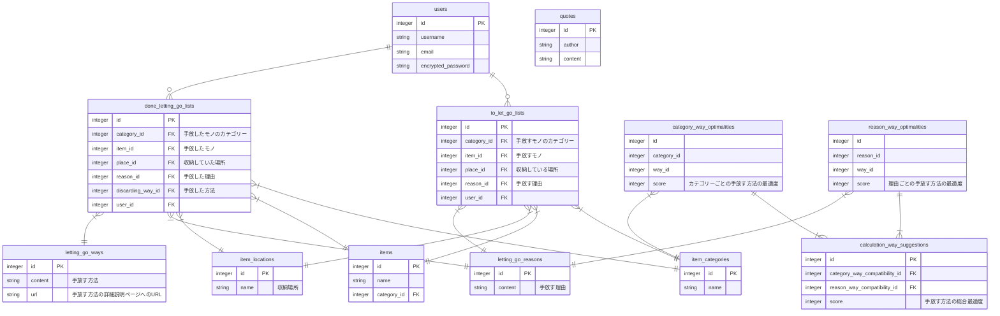

Web系企業でのバックエンドエンジニアとしての就職を目指して、ポートフォリオを制作しています。
ポートフォリオ制作のすべての記録を残していきます。

## この記事は
ポートフォリオ制作の第一歩、テーマ決め・画面遷移図・ER図の作成で考えたことや使った技術についてまとめています。

## テーマ決め
### どのようにテーマを決めたか？
自分の悩みや関心事から、作りたいアプリのテーマを考えました。
私は思考がモヤモヤしてしまうことに悩んでいて、その解決策のひとつとして視界や持ち物をスッキリさせたらよいのでは、と片付けやミニマリズムへの興味を深め始めており、その捨て活のサポートをしてくれるアプリを作りたい！と思い至りました。
自分が使いたいもの、利用していたらQOLが上がりそうなテーマ・アプリを制作物に選ぶとモチベーションを維持しやすいように感じます。

### 決めること
[こちら](https://github.com/sarii0213/ideas/blob/main/karoyaka.md)が私のアプリの要件定義です。 
内容は以下をカバーするように意識しました。
- アプリを一言で言うと（何ができるアプリか）
- アプリの存在意義（問題意識）
- 他に似たようなサービスがないか（競合分析）
- 想定されるユーザー（誰のためのアプリか）
- ユーザーが持つ課題（アプリが越えるべきハードルとは）
- 課題の解決方法（どのような機能を持たせたらユーザーに効果的なサービスを提供できるか）

## 画面遷移図
作成した要件定義を眺めながら、具体的にどんな画面が必要か、どのようなデザインにしたいかをFigmaを使って描いていきました。
[こちら](https://www.figma.com/file/ZGwoJGhwKBfxwR2MqOBl5m/karoyaka?node-id=0%3A1)が私が今回作成した画面遷移図です。

画面遷移図を作る事で、搭載したい機能についてより具体的に考えていけたり、実際にどのように実装していくかの足がかりになると感じました。
ゼロから画面遷移図を作っていくのは大変なので、ウェブアプリのギャラリーサイトやPinterestで自分が好みのデザインを集めて、それらを参考にしながら作図していきました。
ユーザーが使いやすい画面設計になっているか、を第一に意識して作成しました。

## ER図
要件定義・画面遷移図を見ながら、データベースのテーブルを設計していきます。
こちらが今回作成したER図です。

ER図の作成にはmermaid記法を採用しました。draw.ioの方が各テーブルの配置等カスタマイズしやすいですが、デメリットとしてはポチポチ作業が多く、バージョン管理もやりずらいため、今回はmermaidを使って作図しました。
[公式サイト](https://mermaid-js.github.io/mermaid/#/)にmermaid記法の書き方が詳しく説明されています。
[Live Editor](https://mermaid.live/)を使うと、直感的に作成できます。私はLive Editorである程度作ったものをGitHubに上げて、GitHub上で都度修正してバージョン管理をしています。
[こちらの記事](https://zenn.dev/aldagram_tech/articles/a10166f763d30e)では、mermaid記法とその活用について日本語で簡潔に分かりやすくまとめられています。

テーマ決め・画面遷移図・ER図の作成が完了したら、つぎは環境構築です！

## 参考
- [【エンジニア転職】ポートフォリオのアンチパターン3選](https://www.youtube.com/watch?v=sijMiayECwE)
- [エンジニア転職に成功するポートフォリオ戦略!!](https://www.youtube.com/watch?v=nkdz-lLwDZI)
 
